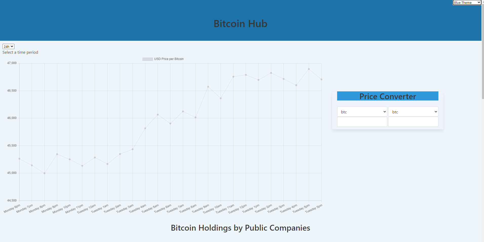

# GrpPrj1-Bitcoin

## User Story

```
AS a user
I want to see price trends, so that I can have a better understanding of the market
I want to convert prices, so that I can see the price comparison between different currencies
I want to see bitcoin market share, so that I can see what companies are investing in BTC

```

## Acceptance Criteria

```
Use a CSS framework other than Bootstrap.

Be deployed to GitHub Pages.

Be interactive (i.e., accept and respond to user input).

Use at least two server-side APIs.

Does not use alerts, confirms, or prompts (use modals).

Use client-side storage to store persistent data.

Be responsive.

Have a polished UI.

Have a clean repository that meets quality coding standards (file structure, naming conventions, follows best practices for class/id naming conventions, indentation, quality comments, etc.).

Have a quality README (with unique name, description, technologies used, screenshot, and link to deployed application)
```

# Page link

 https://jenkinsmd.github.io/GrpPrj1-Bitcoin/

## Mock-Up

The following image shows the web application's appearance and functionality:

